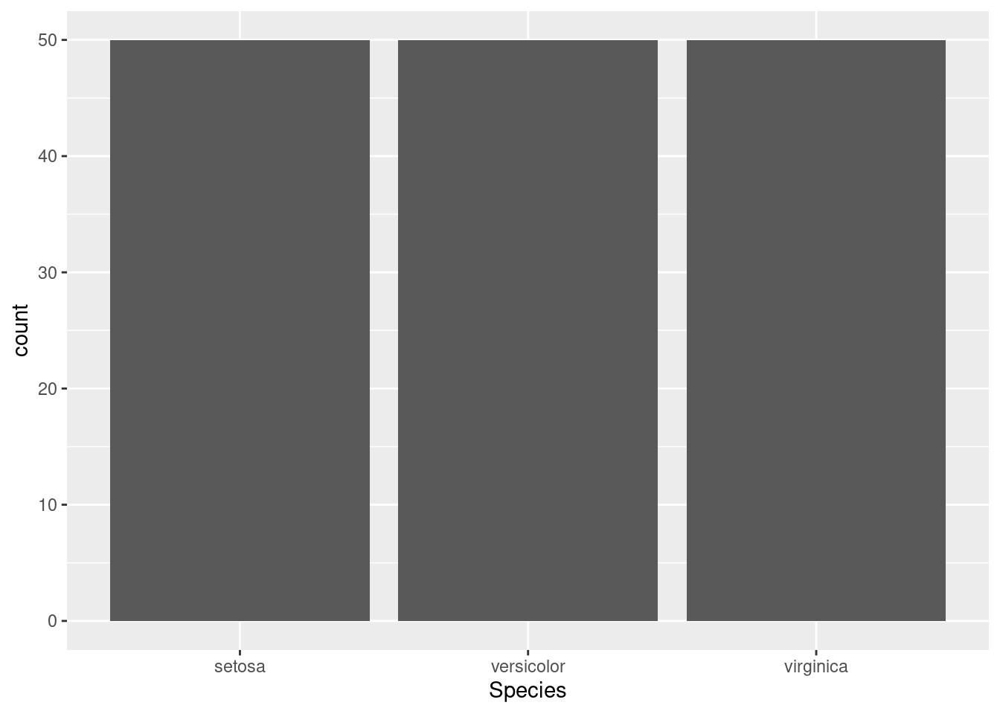
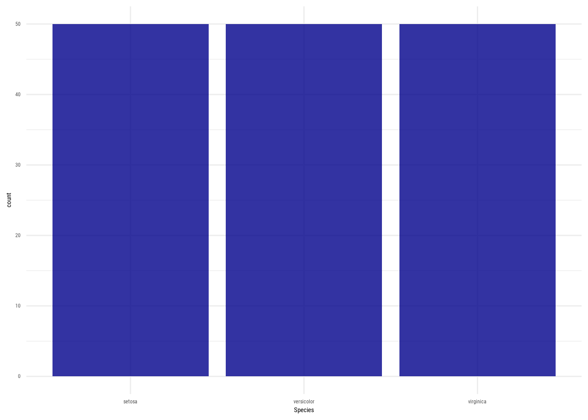

<!-- README.md is generated from README.Rmd. Please edit that file -->

# jrrosell

<!-- badges: start -->

<!-- badges: end -->

## Overview

[jrrosell](#jrrosell) is a personal R package for Jordi Rosell.

## Installation

``` r
# To get the last r-universe release, use:
install.packages("jrrosell", repos = c("https://jrosell.r-universe.dev", "https://cloud.r-project.org"))

# For the last development version, use:
pak::pak("jrosell/jrrosell")
```

## Usage

For example, you can use it for theming ggplot plots.

Instead of:

``` r
library(ggplot2)

ggplot(iris, aes(Species)) +
  geom_bar()
```



You get:

``` r
library(jrrosell)
theme_set_roboto_darkblue()

ggplot(iris, aes(Species)) +
  geom_bar()
```



Are you looking for other functions? [Check the reference
here](https://jrosell.github.io/jrrosell/reference/index.html).

## Getting help

For questions, discussions or bugs, please open an issue on
[GitHub](https://github.com/jrosell/jrrosell/issues).
